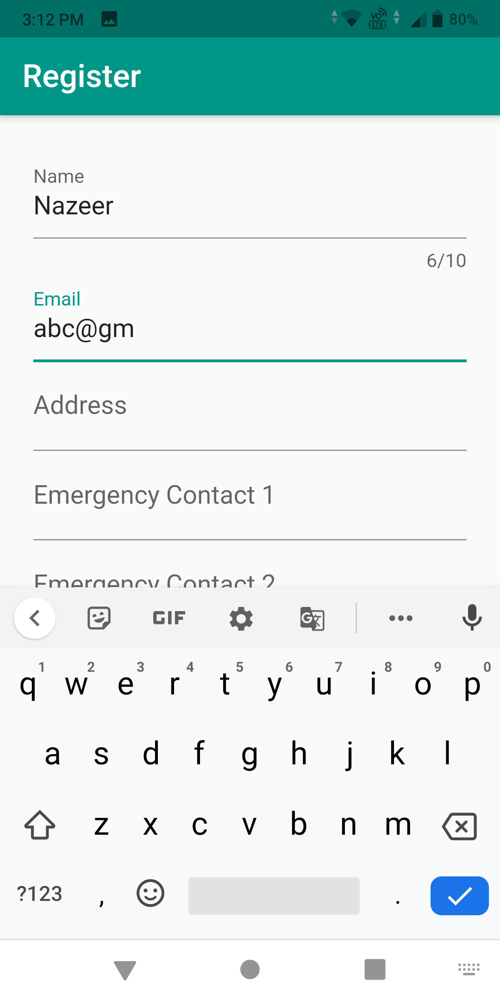
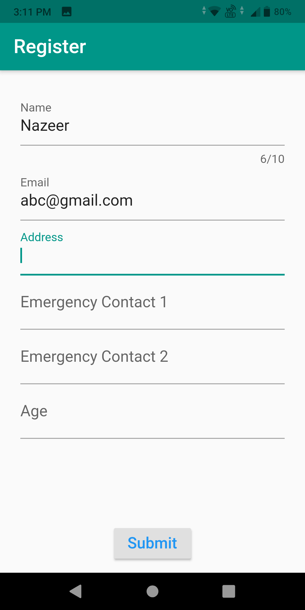
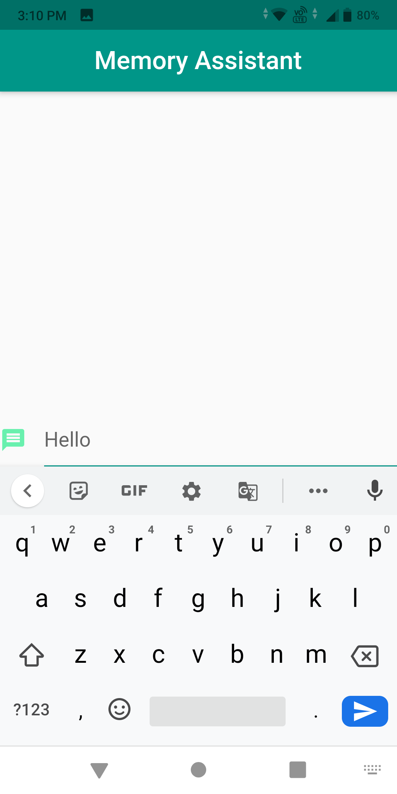
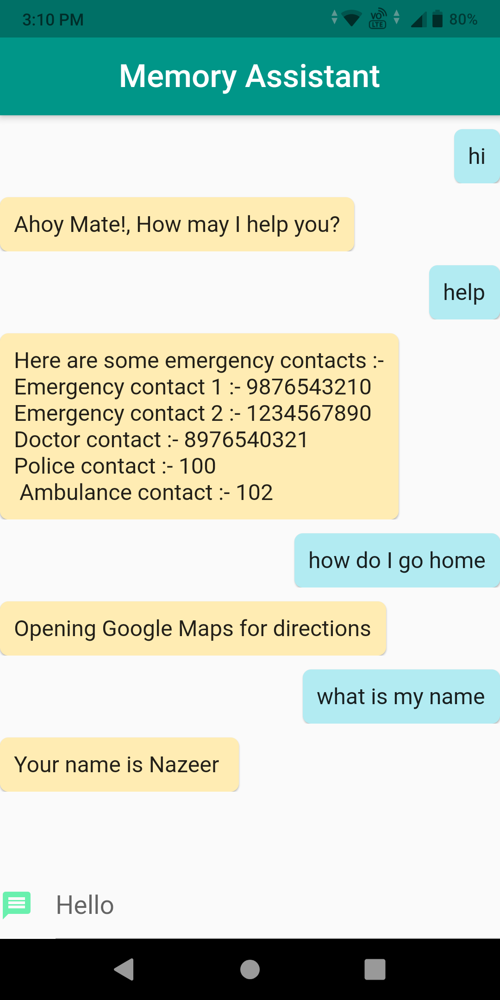

# Memory Assitant - an android app for helping Alzheimer patients

It is an android app built in the form of a chatbot using AIML which helps alzhemier patients whenever they forget anything. It has the ability to talk with the paitient
and provide information ranging from their names to emergency numbers and various other info. It can also be used to view directions back to home, incase the person is lost 
this is implemented using Google Maps API which shows the directions to home. All the essential info like address, emergency contacts, name and other details are collected 
only once when the app is installed.

[Link to backend code](https://github.com/mirameen/memory-assistant)

## Some screenshots of the app :-

### User registration

&nbsp;&nbsp;&nbsp;&nbsp;&nbsp;&nbsp;&nbsp;&nbsp;&nbsp;&nbsp;

### Chatbot in action

&nbsp;&nbsp;&nbsp;&nbsp;&nbsp;&nbsp;&nbsp;&nbsp;&nbsp;&nbsp;

